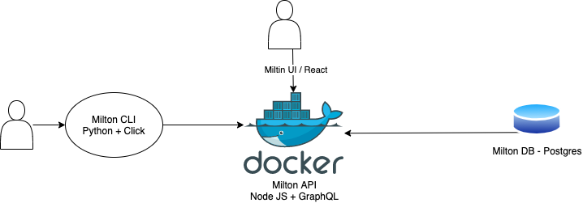

# Milton

An open-source Devops tool for the guy on the team that knows it all.

As an engineering organization grows, so does the need for internal tooling, version management, terminal configurations, and standardization. With the standardization, there is a need for a single internal tool to help with this configuration. Onboarding engineers in an all-remote engineering organization can be complex.

Milton is an open-source DevOps Engineer to help a DevOps team support Developers with on-boarding and local environment setup.

More importantly, Milton also tracks errors, interactions and success. This makes it eaiser for Deveops and Development teams to see where their knowledge of your tooling and capablities are and where you need a knowledge improvement.

THrough the use of Slack, Milton can message users to help them with a problem. This is useful as tools, features and standards grow. Milton's database has a list of FAQs which he can use to help the user with their problem.

Milton allows DevOps teams to enforce and upgrade tooling behind the scenes, while supporting Developer veloicty, software standardization and patches.

## What's the Vision

Milton is a self-hosted solution with a UI for visual reporting, API for UI and CLI traffic, A Postgres DB for tracking and storing configuration and the CLI that all developers downloaded within the organization.

### Phase 1 - API Creation

Create an API that allows a user to create a configuration. A configuration is a single entity that describes a state that a developers machine should be.

EX. User Justin creates a pip configuration stating that the `pip` version needs to be > 19. He then creates a warning message, the shell commands to remediate, and the message for Milton to use when the Configuration is inquired or breached.

This part of the phase will be complete when

- As a user, I can create a configration from a POST request.
- As a user, I can see all Of my configrations
- As a user, I can edit a Confgiration
- As a user, I can delete a confiuration

A User has one Configuration.
A Configuration has many Services
A Service has many Configrations

### Phase 2 - CLI to API

The CLI is the main part of the tool that will make then API calls needed to get the configuration.

### Phase 3 - Reporting

The UI should allow a user to assign other users to a group. A group has a configuration that has all of the needed tools that should be installed on the users machine.
